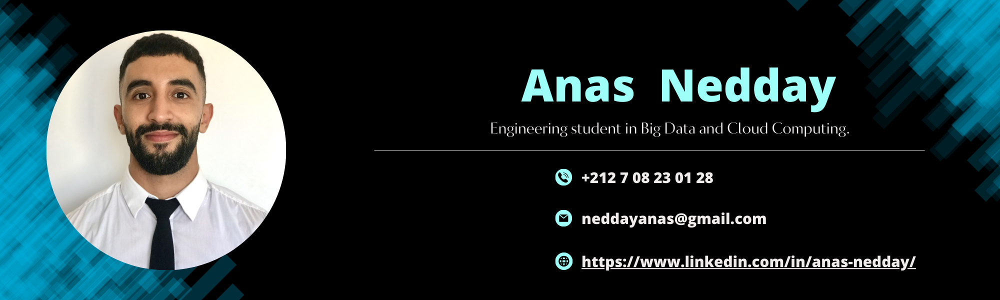
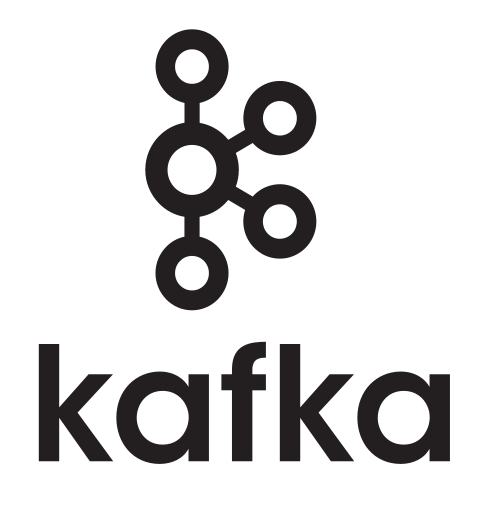

<!-- Intro Section -->

  
  <h1 style="text-align: left; margin: 0;"> Hi there 👋 I'm ANAS NEDDAY </h1>

  

    Engineering student in Big Data and Cloud Computing. Passionate about new technologies, motivated, and endowed with a strong ability to acquire new skills.
  

   <h3>Connect With Me</h3>

  

    
    
    
    
  

<!-- Section for Data Skills -->
## Data Skills
- Data Extraction, Transformation, and Loading (ETL)
- Data analysis
- Data engineering
- Relational databases (SQL)
- Big Data (Hadoop, Spark)
- Data visualization (e.g., Matplotlib, D3.js)
- Machine Learning
- Data Science
- Business Intelligence
- Data Warehousing
- Data exploration

  
  
  
  
  
  
  
  
  
  <!-- Ajoutez ici d'autres compétences liées aux données -->

## Cloud Skills
- Amazon Web Services (AWS)
- Google Cloud Platform (GCP)
- Cloud computing and virtualization
- Serverless computing
- Infrastructure as Code (IaC)
- Containerization and orchestration (e.g., Docker, Kubernetes)

  
  
  
  
  

## Development Skills
- HTML, CSS, JavaScript
- Front-end frameworks (e.g., React, Angular,)
- Back-end frameworks (e.g., Flask, Django..)
- Responsive web design
- Database management (e.g., SQL, NoSQL)
- Full-stack web development
- User-friendly interface design
- Website deployment

  
  
  
  
  
  

